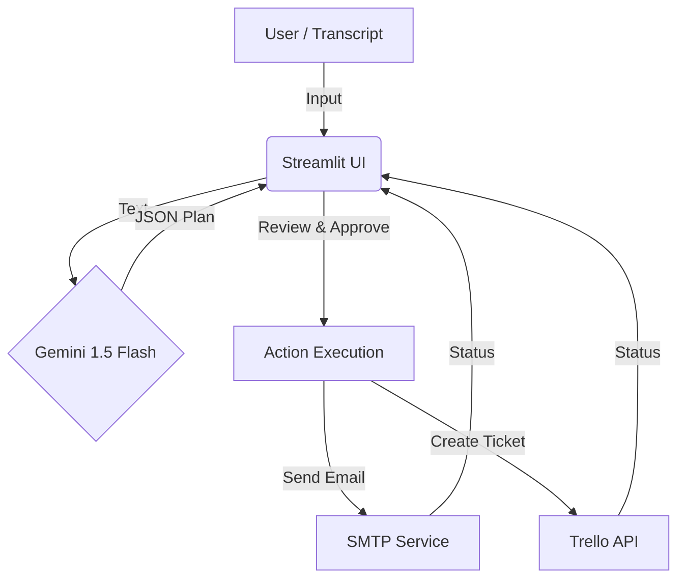

# Meeting Insight Agent 🤖

**Kaggle Agents Intensive Capstone - Enterprise Track**

## Overview
The **Meeting Insight Agent** is an enterprise productivity tool designed to automate the extraction of action items from meeting transcripts. It demonstrates the use of:
- **LLM (Gemini 1.5 Flash):** For understanding context and extracting structured data.
- **Agentic Workflow:** Deciding which tool to use (Email vs. Ticket) based on the content.
- **Observability:** Full visibility into the agent's JSON reasoning process.

## Architecture



## Features
- 📝 **Transcript Analysis:** Converts raw text into structured decisions and action items.
- 🛠️ **Intelligent Routing:** Automatically routes tasks to a mock Email Service or Ticket Service.
- 🔍 **Observability:** View the raw JSON output from the LLM to understand its reasoning.
- ✅ **Human-in-the-Loop:** Review and approve actions before execution.

## Setup

1.  **Clone the Repository:**
    ```bash
    git clone <your-repo-url>
    cd meeting_insight_agent
    ```

2.  **Install Dependencies:**
    ```bash
    pip install -r requirements.txt
    ```

3.  **Get API Key:**
    You need a Google Gemini API Key from [Google AI Studio](https://aistudio.google.com/).

4.  **Run the App:**
    ```bash
    streamlit run app.py
    ```

## Usage
1.  Enter your API Key in the sidebar.
2.  Paste a meeting transcript in the text area.
3.  Click "Analyze Transcript".
4.  Review the extracted action items.
5.  Select actions to execute and click "Execute Selected Actions".
6.  View the simulated output in the "Mock Tool State" section.
